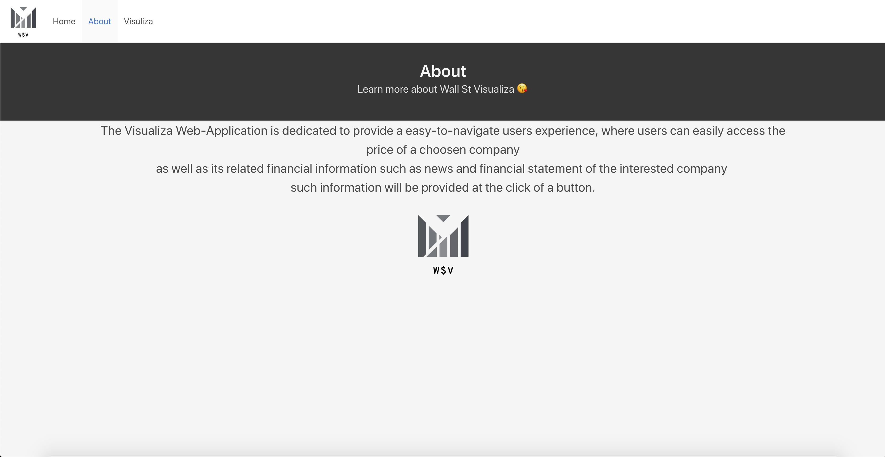

# Wall Street Visualiza

- [Wall Street Visualiza](#Wall-Street-Visualiza)
  - [Website Snapshots](#Website-Snapshots)
  - [Group Members](#Group-Members)
  - [Project Description](#Project-Description)
    - [Who is it for?](#Who-is-it-for)
    - [What will it do?](#What-will-it-do)
    - [What type of data will it store?](#What-type-of-data-will-it-store)
    - [What will users be able to do with this data?](#What-will-users-be-able-to-do-with-this-data)
    - [What is some additional functionality you can add or remove based on time constraints?](#What-is-some-additional-functionality-you-can-add-or-remove-based-on-time-constraints)
  - [Project Task Requirements](#Project-Task-Requirements)
    - [Minimal Requirement](#Minimal-Requirement)
    - [Standard Requirements](#Standard-Requirements)
    - [Stretch Requirements](#Stretch-Requirements)
  - [Minimum Requirement Task BreakDown](#Minimum-Requirement-Task-BreakDown)
    - [Requirement 1: Category Box for a Given Company](#Requirement-1-Category-Box-for-a-Given-Company)
    - [Requirement 2: Graphical representation of the price movement using charts](#Requirement-2-Graphical-representation-of-the-price-movement-using-charts)
  - [UI Design](#UI-Design)

## Website Snapshots

## Group Members

- Kyo Tang
- Eric Xiao
- Kaitian Xie
- Honourable mention: Kristy Yang ([@kristyyang](https://github.com/kristyyang)) as our UI designer

## Project Description
### High Level Description 
Wall-street-Visualiza is created to help investors to have easy acess to performance of a particular company that they are intereted in investing. Specifically, each companies financial statements is only one click away and all news related to the company can be filtered based on the dates selected. This way, the investor can both analyze and evaluate the company both fundamentally and behaviourily.
### Who is it for?

The project we are aiming to build is a visualization tool for users who are interested in understanding the price movements of a given publicly traded company.

### What will it do?

We will be presenting a graphical representation of price movement of a given publicly traded company. Specifically, it will be a time-series graph where the horizontal axis will be labeled with time and vertical axis will be labelled with price.

In addition, we intend to attach quarterly financial statements on days when they are released and specific color node will be used to reflect such important information release. This will allow users to easy access to such information.

### What type of data will it store?

The data stored in the project is of many forms. Specifically, data for the price movement of a particular company are of numerical value or strings. Data for the financial statements are links to the quarterly financial report.

### What will users be able to do with this data?

Users can compile all the data to perform fundamental analysis of a given publicly traded company.

### What is some additional functionality you can add or remove based on time constraints?

We are hoping to add news links to days where important news are released for a given publicly traded company.  And category the release based on the source it came from so that users can analyze the tone that a particular news outlet is projecting for this company.

## Project Task Requirements

### Minimal Requirement

- A category box that when selected will lead to the web-page of a given company.
- Graphical representation of the price movement using charts.
- Links to Financial Statement of a chosen company

### Standard Requirements

- A search box that allow users to search for the company that the user is interested in.
- A category box for a given company to show all available financial statements.
- A category box for a given company that categorize all the news from one news outlet.

### Stretch Requirements

- Ensuring the the tool can accommodate users to browse through at least 10 companies.
- Ensuring that all important news are featured for one particular company.

### Requirement BreakDown For The Last 5 Weeks
- Ensuring the data will be loaded onto atlas instead of using local database 
- Ensuring that news data has another graphical indication that represents whether the new about a given company is positive or negative 
- Ensuring that news data has an image for each of them 
- Eusuring that data are loaded rapidly 
- Ensuring that data is cached once server starts 
- Ensuring that data is updated daily. 
## UI Design

## Documentation

## Basic Technology Requirement
- Use of React, Redux, Css, will be found in the import directory where they are spread out within the UI directory
- Use of MongoDb, Axios, Express can be found in vendor and api file of the import directory

## Basic Contribution Requirement
- Kaitian, mostly made his contribution to the project by implementating react, redux and css appropriately to ensure our front end looks professional and concise.
- Kyo, mostly made his contribution to the project by implementing the mongdb database, handling the api request and finding appropriate api services that can provide all the data. Furtheremore, cleaning the data to appropriate formats for rendering

## Basic Funtionality Requirement
- The project intends to allow finanacial analyst towho want to have a quick analysis of a company that they are interested in whether through visualization , fundamental analysis or through pricing analysis. 

- We have managed to provided the basic funcationalities. Specifically, users can register an account and easily search throguh with auto suggest or scroll through the list of company that they are intersted in. Once the company of interest has been chosen they will be able to see the companies stock price performance ,downloading the company's financial statement as well as checking all the news regarding this specifically company with a sentiment indicator. 

## Challenges, Learning, and Future Directions
- The projet did encounter several challenges on its way to completion.
- Problem: We were not able to secure a reliable API to get the financial information initially 
- Initial Solution: Attempting to write a web-scrapper to get all appropriate information, noticing the amount of work it would take to scrapp information from a particular website is quite challenging
- Final Solution: Found both API that can provide news and stock information and financial statements
- Problem: The API found can not handle too many simulatnenous request at any given time
- Final Solution: Setting up a time interval in between each request therefore the sever no longer provides a 404 response
- To further progress the project, we will be using the financial ratio api to download all other financial metrics that will be switched from the current pricing window to the other display mode where users can choose a metric of interst to perform analysis and visualization
- We will also try to build a little watchlist so that users can have their favourites 
- We will also try to buold a little comparision window side by side for any two stocks of interest.

## Initiative and Additional Contribution:
- Kaitian, has noticed and shown to all the group memebers how react-hook can simplify the react-redux store/extract data experience. Not only users can type less code. But also it allows users to treat redux-store as a blackbox, simplying using the build in methods such as useSelector, or useDispatch to simply do what you want to do instead of repeated figure out which units need to subsribe to the store and how the module have to mapStatetoProps etc.
